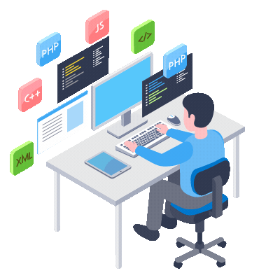

<h1 align="center">Hi, I'm Arel Gabay</h1>

<h3 align="center">
  Full Stack Developer · Computer Science Student · Building production-inspired software
</h3>

  
  
  

  

---

## About Me

I'm a Computer Science student and full stack developer focused on building clean, practical, and production-inspired software.

I enjoy working across the stack, from backend APIs and database design to modern frontend interfaces. My current focus is improving my engineering depth through real projects that emphasize architecture, maintainability, and user experience.

- Building full-stack applications with **React**, **TypeScript**, **Python**, **FastAPI**, and **Node.js**
- Interested in **AI infrastructure**, **observability**, **developer tools**, and **clean backend architecture**
- Practicing software design through projects with real APIs, databases, SDKs, tests, and CI
- Comfortable with frontend development, REST APIs, SQL/NoSQL databases, and Git workflows
- Always learning and improving through hands-on engineering projects

Current highlight project:

**AgentOps** — a full-stack AI agent observability platform with a FastAPI backend, React frontend, PostgreSQL database, Python SDK, real telemetry ingestion, dashboard metrics, traces, evaluations, tests, and GitHub Actions CI.

---

## Featured Project

### AgentOps

AgentOps is a full-stack observability platform for AI agents.

It helps developers collect and inspect traces, spans, latency, token usage, costs, evaluation scores, and execution status from AI workflows.

Core technologies:

- **Frontend:** React, TypeScript, Tailwind CSS, React Query
- **Backend:** Python, FastAPI, SQLAlchemy, PostgreSQL
- **SDK:** Local Python SDK with optional LangChain integration
- **DevOps:** Docker Compose, GitHub Actions CI
- **Architecture:** MVC backend, typed frontend services, reusable UI components

Project focus:

- Clean full-stack architecture
- Real backend-backed dashboards
- Trace and span debugging
- Evaluation tracking
- Local SDK telemetry ingestion
- Recruiter-friendly V1 demo and documentation

---

## Tech Stack

### Languages

  
  
  
  
  
  
  

### Frontend

  
  
  
  
  

### Backend

  
  
  
  
  

### Databases

  
  
  
  
  

### Tools And Workflow

  
  
  
  
  
  

---

## Engineering Interests

- Full-stack product development
- Backend architecture and API design
- AI infrastructure and observability
- Clean architecture and MVC design
- Database modeling and query design
- Developer tools and SDKs
- Testing, CI, and maintainable workflows

---

## GitHub Stats

<table align="center" width="100%">
  <tr>
    <td align="center" width="33%">
      
    </td>
    <td align="center" width="33%">
      
    </td>
    <td align="center" width="33%">
      
    </td>
  </tr>
</table>

---

## Contact

  
  

